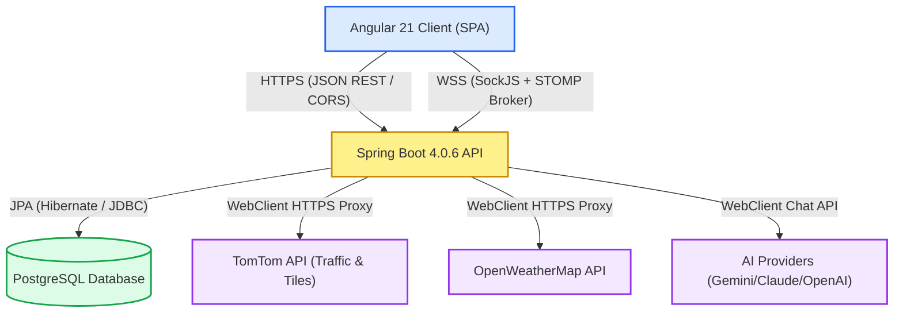
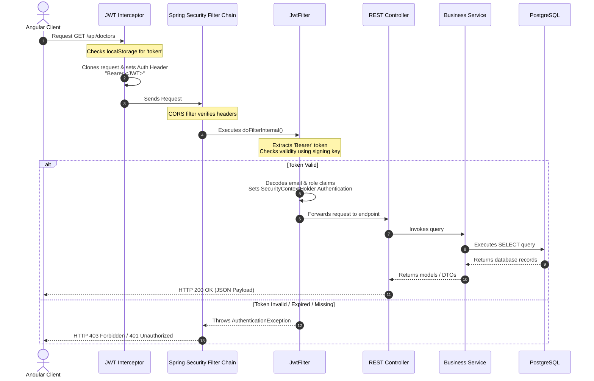
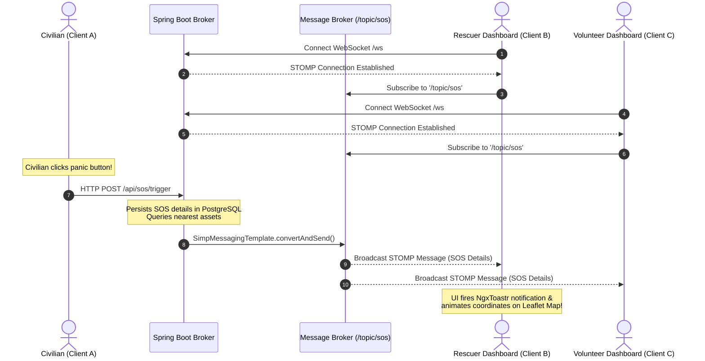

# ResQNet System Architecture Guide

This document describes the architectural blueprints, communication flows, and algorithmic engines driving the **ResQNet (Disaster Management & Civic Support Network)** platform.

---

## 1. High-Level Architectural Overview

ResQNet is built as a highly responsive, modern, multi-tier enterprise application designed to operate reliably under crisis scenarios (such as natural disasters, floods, or medical emergencies).

The architecture consists of three core tiers:
1. **Presentation Layer (Frontend)**: Angular 21 Single Page Application (SPA), providing an interactive dashboard, Leaflet GIS mapping, real-time notifications, and mobile-friendly responsive views.
2. **Business & Application Layer (Backend)**: Spring Boot 4.0.6 REST and WebSocket API, handling authentication, data validation, geo-location queries, AI assistance, and persistent database mappings.
3. **Data Persistence Layer (Database)**: PostgreSQL Relational Database, storing user credentials, profiles, disaster logs, safe zones, ambulances, and emergency reports.



---

## 2. Frontend ↔ Backend Communication Modes

To guarantee low latency, real-time alerts, and high security, communication between the Angular client and Spring Boot backend runs over two distinct protocols:

### A. HTTP REST APIs (Stateless Communication)
Used for standard transactional operations (e.g., user signup, retrieving doctor databases, reporting missing persons, and updating profiles).
* **Protocol**: HTTPS (HTTP/1.1)
* **Payload Format**: JSON (JavaScript Object Notation)
* **Authentication**: Stateless bearer token model. A JSON Web Token (JWT) is attached to the `Authorization` header of every outbound request.

### B. WebSocket Pub-Sub Brokers (Stateful Real-time Communication)
Used to instantly broadcast high-priority events (such as newly triggered SOS alarms or critical disaster warnings) to all active dashboard users without client polling.
* **Protocol**: STOMP (Simple Text Oriented Messaging Protocol) established over SockJS fallbacks.
* **Endpoint**: `/ws` (Public access point)
* **Message Broker Topics**:
  - `/topic/disasters` (For real-time disaster alerts)
  - `/topic/sos` (For real-time SOS broadcasts)

---

## 3. Core Architectural Flows

### A. Authentication & Request Lifecycle
ResQNet implements a strictly stateless security configuration using **Spring Security 6.x / 4.x** and JWT tokens. This ensures high availability and horizontal scaling capacity.



---

## 4. Real-Time Emergency Pub-Sub Broker Flow

When an emergency dispatcher or civilian triggers an alert, it must propagate to all connected clients within milliseconds. This is managed by the STOMP message broker.



---

## 5. Layered Backend Design Pattern

The Spring Boot backend enforces a clean, modular, layered architecture to decouple concerns and make onboarding easy:

1. **Controller Layer (`com.pu_deltaforce.resqnet_backend.controller`)**: Exposes REST interfaces, handles URL routing, intercepts path variables, and returns HTTP responses.
2. **DTO Layer (`com.pu_deltaforce.resqnet_backend.dto`)**: Data Transfer Objects defining strict request payloads and tailored JSON response shapes (shielding DB entities).
3. **Service Layer (`com.pu_deltaforce.resqnet_backend.service`)**: The core transactional engine executing all validation rules, external proxy orchestrations, and algorithmic calculations.
4. **Repository Layer (`com.pu_deltaforce.resqnet_backend.repository`)**: Data Access Objects extending `JpaRepository` to abstract SQL operations using Spring Data JPA.
5. **Model Layer (`com.pu_deltaforce.resqnet_backend.model`)**: Rich JPA domain entities decorated with Hibernate annotations mapping fields directly to PostgreSQL tables.

---

## 6. Algorithmic Highlights: Haversine Distance Engine

One of ResQNet's primary technical features is the **dynamic proximity engine** invoked during an SOS trigger. 

When a civilian triggers an SOS, the system automatically locates the **nearest available ambulance** and the **closest safe zone** to display them on the user's dashboard.

### A. The Mathematical Model (Haversine Formula)
Because the earth is a sphere, simple Euclidean distance ($d = \sqrt{\Delta x^2 + \Delta y^2}$) introduces significant error. Instead, ResQNet utilizes the **Haversine Formula**, which computes the great-circle distance between two coordinate points:

$$d = 2R \arcsin\left(\sqrt{\sin^2\left(\frac{\Delta \phi}{2}\right) + \cos(\phi_1)\cos(\phi_2)\sin^2\left(\frac{\Delta \lambda}{2}\right)}\right)$$

Where:
* $R$ is the Earth's radius (approx. $6371 \text{ km}$)
* $\phi_1, \phi_2$ are the latitudes of point 1 and point 2 in radians
* $\lambda_1, \lambda_2$ are the longitudes of point 1 and point 2 in radians
* $\Delta \phi = \phi_2 - \phi_1$
* $\Delta \lambda = \lambda_2 - \lambda_1$

### B. Java Code Implementation (`SosService.java`)
The algorithm is written in Java and uses Java 8 Streams to find the nearest asset with $O(N)$ efficiency:

```java
// Calculating distance between two points on Earth's surface
private double distance(double lat1, double lng1, double lat2, double lng2) {
    double R = 6371; // Earth's radius in kilometers
    double dLat = Math.toRadians(lat2 - lat1);
    double dLng = Math.toRadians(lng2 - lng1);
    double a = Math.sin(dLat / 2) * Math.sin(dLat / 2)
            + Math.cos(Math.toRadians(lat1)) * Math.cos(Math.toRadians(lat2))
            * Math.sin(dLng / 2) * Math.sin(dLng / 2);
    return R * 2 * Math.atan2(Math.sqrt(a), Math.sqrt(1 - a));
}

// Finding the nearest available ambulance using Streams
private Ambulance findNearestAmbulance(List<Ambulance> list, Double lat, Double lng) {
    return list.stream()
            .filter(a -> a.getCurrentLatitude() != null && a.getCurrentLongitude() != null)
            .min((a, b) -> Double.compare(
                    distance(lat, lng, a.getCurrentLatitude(), a.getCurrentLongitude()),
                    distance(lat, lng, b.getCurrentLatitude(), b.getCurrentLongitude())
            )).orElse(list.isEmpty() ? null : list.get(0));
}
```
This formula is executed instantly on a background thread when `/api/sos/trigger` is invoked, returning immediate response coordinates to the user.
