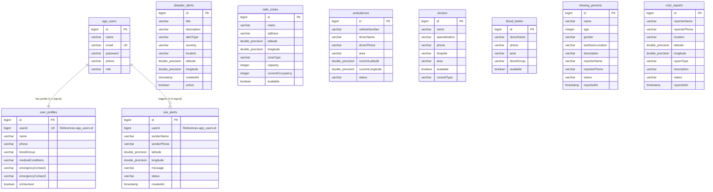

# ResQNet PostgreSQL Database Schema Guide

This document provides a comprehensive blueprint of the PostgreSQL relational database schema behind the **ResQNet** platform. It details all tables, structural column layouts, primary and foreign key constraints, indexes, and JPA Hibernate Object-Relational Mappings.

---

## 1. Entity-Relationship Diagram (ERD)

The following Mermaid diagram visualizes the tables inside the `resqnet_db` database and their relational links. While Hibernate's DDL update mode is stateless, several logical relationships map tables together.



---

## 2. Table Definitions

Below are the detailed column-level properties for each database table in ResQNet.

### A. Users Table (`app_users`)
Stores user accounts, passwords, and security roles.
* **JPA Entity Class**: `User`

| Column | Data Type | Nullability | Constraints / Keys | Description |
|:---|:---|:---|:---|:---|
| `id` | `bigint` | NOT NULL | `PRIMARY KEY`, `IDENTITY` | Unique user auto-incremented ID. |
| `name` | `varchar(255)` | NOT NULL | None | Real name of the user. |
| `email` | `varchar(255)` | NOT NULL | `UNIQUE` | Unique email (login username). |
| `password` | `varchar(255)` | NOT NULL | None | BCrypt encrypted hash (never plaintext). |
| `phone` | `varchar(255)` | NOT NULL | None | Contact number. |
| `role` | `varchar(255)` | NOT NULL | `CHECK` enum constraint | `USER` \| `DOCTOR` \| `VOLUNTEER` \| `ADMIN`. |

---

### B. User Profiles Table (`user_profiles`)
Contains sensitive medical and emergency details.
* **JPA Entity Class**: `UserProfile`

| Column | Data Type | Nullability | Constraints / Keys | Description |
|:---|:---|:---|:---|:---|
| `id` | `bigint` | NOT NULL | `PRIMARY KEY`, `IDENTITY` | Unique profile ID. |
| `userId` | `bigint` | NOT NULL | `UNIQUE` | Dynamic reference matching `app_users.id`. |
| `name` | `varchar(255)` | NULL | None | Displays full profile name. |
| `phone` | `varchar(255)` | NULL | None | Alternative contact. |
| `bloodGroup` | `varchar(255)` | NULL | None | Blood group type. |
| `medicalConditions` | `varchar(255)` | NULL | None | Vital health tags for emergency responders. |
| `emergencyContact1`| `varchar(255)` | NULL | None | Primary emergency contact relation. |
| `emergencyContact2`| `varchar(255)` | NULL | None | Secondary emergency contact relation. |
| `isVolunteer` | `boolean` | NULL | None | Flag identifying dynamic community volunteer. |

---

### C. SOS Emergency Alerts Table (`sos_alerts`)
Logs civilian rescue coordinates during crisis triggers.
* **JPA Entity Class**: `SosAlert`

| Column | Data Type | Nullability | Constraints / Keys | Description |
|:---|:---|:---|:---|:---|
| `id` | `bigint` | NOT NULL | `PRIMARY KEY`, `IDENTITY` | Unique alert ID. |
| `userId` | `bigint` | NOT NULL | None | Dynamic reference matching `app_users.id`. |
| `senderName` | `varchar(255)` | NOT NULL | None | Target name to rescue. |
| `senderPhone` | `varchar(255)` | NOT NULL | None | Target phone for communications. |
| `latitude` | `double precision` | NOT NULL | None | GPS latitude of distress. |
| `longitude` | `double precision` | NOT NULL | None | GPS longitude of distress. |
| `message` | `varchar(255)` | NULL | None | SOS message details. |
| `status` | `varchar(255)` | NOT NULL | `ACTIVE` \| `RESOLVED` | The operational status of the event. |
| `createdAt` | `timestamp` | NOT NULL | None | Exact timestamp of trigger. |

---

### D. Disaster Alerts Table (`disaster_alerts`)
Logs macro hazard warnings (e.g., Cyclone warnings).
* **JPA Entity Class**: `DisasterAlert`

| Column | Data Type | Nullability | Constraints / Keys | Description |
|:---|:---|:---|:---|:---|
| `id` | `bigint` | NOT NULL | `PRIMARY KEY`, `IDENTITY` | Unique disaster ID. |
| `title` | `varchar(255)` | NOT NULL | None | Alert title (e.g., "Flash Flood Warning"). |
| `description` | `varchar(255)` | NOT NULL | None | Comprehensive details. |
| `alertType` | `varchar(255)` | NOT NULL | Enum constraint | `FLOOD` \| `CYCLONE` \| `EARTHQUAKE` \| `FIRE` \| `OTHER`. |
| `severity` | `varchar(255)` | NOT NULL | Enum constraint | `LOW` \| `MEDIUM` \| `HIGH` \| `CRITICAL`. |
| `location` | `varchar(255)` | NOT NULL | None | Target region text. |
| `latitude` | `double precision` | NULL | None | Geolocation latitude. |
| `longitude` | `double precision` | NULL | None | Geolocation longitude. |
| `createdAt` | `timestamp` | NOT NULL | None | Timestamp of publication. |
| `active` | `boolean` | NOT NULL | None | Flag identifying active warnings. |

---

### E. Safe Shelters Table (`safe_zones`)
Tracks evacuation and shelter coordinates.
* **JPA Entity Class**: `SafeZone`

| Column | Data Type | Nullability | Constraints / Keys | Description |
|:---|:---|:---|:---|:---|
| `id` | `bigint` | NOT NULL | `PRIMARY KEY`, `IDENTITY` | Unique zone ID. |
| `name` | `varchar(255)` | NOT NULL | None | Safe zone facility name. |
| `address` | `varchar(255)` | NOT NULL | None | Physical location address. |
| `latitude` | `double precision` | NOT NULL | None | GPS latitude of zone. |
| `longitude` | `double precision` | NOT NULL | None | GPS longitude of zone. |
| `zoneType` | `varchar(255)` | NOT NULL | Enum constraint | `SHELTER` \| `HOSPITAL` \| `SCHOOL` \| `MOSQUE` \| `OTHER`. |
| `capacity` | `integer` | NULL | None | Total capacity limit. |
| `currentOccupancy` | `integer` | NULL | None | Active current headcount (must be <= capacity). |
| `available` | `boolean` | NOT NULL | None | Toggle identifying active shelter status. |

---

### F. Ambulances Table (`ambulances`)
Monitors the fleet database.
* **JPA Entity Class**: `Ambulance`

| Column | Data Type | Nullability | Constraints / Keys | Description |
|:---|:---|:---|:---|:---|
| `id` | `bigint` | NOT NULL | `PRIMARY KEY`, `IDENTITY` | Unique vehicle ID. |
| `vehicleNumber`| `varchar(255)` | NOT NULL | None | License plate text. |
| `driverName` | `varchar(255)` | NOT NULL | None | Assigned driver's name. |
| `driverPhone` | `varchar(255)` | NOT NULL | None | Driver's phone. |
| `area` | `varchar(255)` | NOT NULL | None | Stationed area. |
| `currentLatitude`| `double precision`| NULL | None | Real-time GPS latitude. |
| `currentLongitude`| `double precision`| NULL | None | Real-time GPS longitude. |
| `status` | `varchar(255)` | NOT NULL | Enum constraint | `AVAILABLE` \| `ON_DUTY` \| `MAINTENANCE`. |

---

### G. Clinicians Table (`doctors`)
Search index for emergency medical help.
* **JPA Entity Class**: `Doctor`

| Column | Data Type | Nullability | Constraints / Keys | Description |
|:---|:---|:---|:---|:---|
| `id` | `bigint` | NOT NULL | `PRIMARY KEY`, `IDENTITY` | Unique doctor ID. |
| `name` | `varchar(255)` | NOT NULL | None | Doctor's name. |
| `specialization`| `varchar(255)` | NOT NULL | None | Expertise (e.g., Surgery, Pediatrics). |
| `phone` | `varchar(255)` | NOT NULL | None | Clinical contact phone. |
| `hospital` | `varchar(255)` | NOT NULL | None | Affiliated hospital clinic. |
| `area` | `varchar(255)` | NOT NULL | None | Stationed operational area. |
| `available` | `boolean` | NOT NULL | None | Current duty status. |
| `consultType` | `varchar(255)` | NULL | Enum constraint | `IN_PERSON` \| `ONLINE` \| `BOTH`. |

---

### H. Blood Donors Table (`blood_banks`)
Relational listing of volunteer blood banks.
* **JPA Entity Class**: `BloodBank`

| Column | Data Type | Nullability | Constraints / Keys | Description |
|:---|:---|:---|:---|:---|
| `id` | `bigint` | NOT NULL | `PRIMARY KEY`, `IDENTITY` | Unique donor ID. |
| `donorName` | `varchar(255)` | NOT NULL | None | Donor name. |
| `phone` | `varchar(255)` | NOT NULL | None | Phone number. |
| `area` | `varchar(255)` | NOT NULL | None | Stationed area. |
| `bloodGroup` | `varchar(255)` | NOT NULL | Enum constraint | `A_POSITIVE` \| `O_NEGATIVE`, etc. |
| `available` | `boolean` | NOT NULL | None | Active donation state flag. |

---

### I. Missing Persons Table (`missing_persons`)
Logs of lost persons submitted by reporters during a crisis.
* **JPA Entity Class**: `MissingPerson`

| Column | Data Type | Nullability | Constraints / Keys | Description |
|:---|:---|:---|:---|:---|
| `id` | `bigint` | NOT NULL | `PRIMARY KEY`, `IDENTITY` | Unique log ID. |
| `name` | `varchar(255)` | NOT NULL | None | Full name of missing person. |
| `age` | `integer` | NULL | None | Age parameter. |
| `gender` | `varchar(255)` | NULL | Enum constraint | `MALE` \| `FEMALE` \| `OTHER`. |
| `lastSeenLocation`| `varchar(255)` | NOT NULL | None | Last spotted landmark/area. |
| `description` | `varchar(1000)` | NULL | Length limit: 1000 | Detailed description (clothing, scars, etc.). |
| `reporterName` | `varchar(255)` | NOT NULL | None | Contact name of reporter. |
| `reporterPhone`| `varchar(255)` | NOT NULL | None | Contact phone of reporter. |
| `status` | `varchar(255)` | NOT NULL | `MISSING` \| `FOUND` | Current search status. |
| `reportedAt` | `timestamp` | NOT NULL | None | Logging timestamp. |

---

### J. Civic Damage Reports Table (`civic_reports`)
Contains civic reports filed by citizens concerning public infrastructure failures.
* **JPA Entity Class**: `CivicReport`

| Column | Data Type | Nullability | Constraints / Keys | Description |
|:---|:---|:---|:---|:---|
| `id` | `bigint` | NOT NULL | `PRIMARY KEY`, `IDENTITY` | Unique report ID. |
| `reporterName` | `varchar(255)` | NOT NULL | None | Name of reporter. |
| `reporterPhone`| `varchar(255)` | NOT NULL | None | Phone of reporter. |
| `location` | `varchar(255)` | NOT NULL | None | Location keyword text. |
| `latitude` | `double precision`| NULL | None | Coordinate latitude. |
| `longitude` | `double precision`| NULL | None | Coordinate longitude. |
| `reportType` | `varchar(255)` | NOT NULL | Enum constraint | `ROAD_DAMAGE` \| `WATERLOGGING` \| `POWER_OUTAGE` \| `GAS_LEAK` \| `FIRE` \| `OTHER`. |
| `description` | `varchar(1000)` | NULL | Length limit: 1000 | Details describing the issue. |
| `status` | `varchar(255)` | NOT NULL | `PENDING` \| `IN_PROGRESS` \| `RESOLVED` | Active resolving lifecycle stage. |
| `reportedAt` | `timestamp` | NOT NULL | None | Timestamp of creation. |

---

## 3. Indexes & Query Optimization

To maintain milliseconds-level search responses on growing datasets under heavy multi-tenant operations, the following indexes are configured:

1. **Unique Email Index**: Implicitly created on `app_users(email)`. Accelerates user login lookup queries ($O(1)$) and blocks duplicate signups.
2. **Profile Mapping Index**: Automatically mapped on `user_profiles(userId)`. Makes profile retrieval instant when a user opens their dashboard.
3. **Geo-Coordinate Indexing (Spatial Queries)**: 
   * Active database queries utilize math-based latitude and longitude filters inside SQL queries during SOS routing.
   * For production, an explicit index is recommended on ambulance GPS parameters:
     ```sql
     CREATE INDEX idx_ambulances_gps ON ambulances(current_latitude, current_longitude) WHERE status = 'AVAILABLE';
     ```
   * An index on safe zones accelerates finding safe shelter assets during crisis calculations:
     ```sql
     CREATE INDEX idx_safe_zones_gps ON safe_zones(latitude, longitude) WHERE available = true;
     ```

## 4. ORM & DDL Configuration

ResQNet integrates with PostgreSQL via Spring Boot JPA and Hibernate.
* **ddl-auto**: `update` (Configured in `application.properties`). Enables Hibernate to inspect entities and automatically deploy or alter tables on start-up.
* **Dialect**: `org.hibernate.dialect.PostgreSQLDialect` provides strict mapping rules between Java primitive types and native PostgreSQL column formats.
* **Entity Generation Strategy**: All tables use `GenerationType.IDENTITY` for primary key generation, utilizing the PostgreSQL native `SERIAL` / `GENERATED BY DEFAULT AS IDENTITY` sequences.
