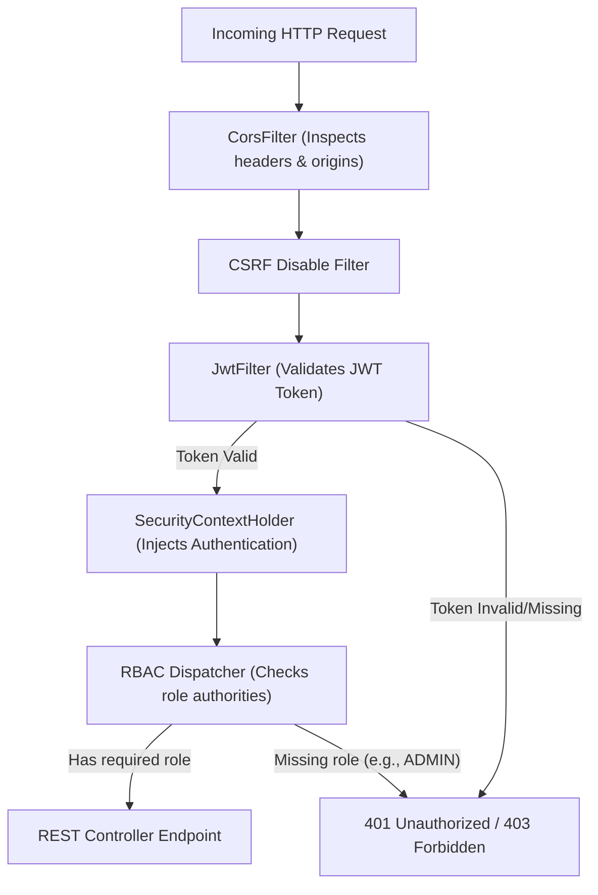

# ResQNet Security & Error Handling Guide

This document details the security layers, encryption standards, authentication lifecycles, role access policies, and centralized exception handling architectures implemented in **ResQNet**.

---

## 1. Security Architecture & Framework

ResQNet implements a zero-trust, stateless API security paradigm. 

The backend employs **Spring Security 6.x / 4.x** with all session state removed from the API node. The client manages its own token state in-memory or in persistent local storage.



---

## 2. Stateless JSON Web Token (JWT) Specifications

Session handling is driven by signed JSON Web Tokens (JWTs).

### A. JWT Token Composition
Tokens generated by `JwtUtil.java` consist of three Base64URL-encoded parts separated by dots:
1. **Header**: Declares the token type (`JWT`) and hashing algorithm (`HS256`).
2. **Payload**: Houses user identity details and custom access privilege attributes:
   * `sub` (Subject): The authenticated user's email address.
   * `role`: The security role of the user (`USER | DOCTOR | VOLUNTEER | ADMIN`).
   * `iat` (Issued At): Milliseconds epoch when the token was compiled.
   * `exp` (Expiration): Exact epoch when the token loses validity.
3. **Signature**: Cryptographic signature protecting against payload tampering. Compiled via:
   $$\text{Signature} = \text{HMAC-SHA256}(\text{Header} + "." + \text{Payload}, \text{SecretKey})$$

### B. JWT Configuration Parameters (`application.properties`)
* **Secret Key**: `jwt.secret` (A strong key used to build HMAC-SHA signatures)
* **Token Expiration**: `jwt.expiration=86400000` (Equivalent to `24 hours` in milliseconds)

### C. JWT Validation & Signature Verification (`JwtUtil.java`)
The backend uses **JJWT 0.13.0** to verify incoming signatures. If a token's signature does not match, a `JwtException` is thrown, rejecting the client:
```java
private Claims getClaims(String token) {
    return Jwts.parser()
            .verifyWith((javax.crypto.SecretKey) getSigningKey())
            .build()
            .parseSignedClaims(token)
            .getPayload();
}
```

---

## 3. Role-Based Access Control (RBAC) Matrix

ResQNet defines four distinct user roles, each carrying discrete privileges:

| Role | Description | Allowed Enpoints & Actions |
|:---|:---|:---|
| **ADMIN** | System Administrator | Full access to the administration suite (`/api/admin/**`), user role upgrading, SOS override controls, metrics queries, and all standard operations. |
| **DOCTOR** | Registered Clinician | Register public health profiles, update duty schedules, and accept emergency telemedicine requests. Includes all standard civilian features. |
| **VOLUNTEER** | Community Volunteer | Can be queried as disaster relief workers. Includes standard civilian permissions. |
| **USER** | Standard Civilian | Can trigger panic buttons (`/api/sos/trigger`), file infrastructure incident logs (`/api/civic-reports`), report missing persons, view public shelters, and chat with ResQBot AI. |

### Endpoint Access Mappings (`SecurityConfig.java`)

| Route Pattern | Required Role / Authority | Description |
|:---|:---|:---|
| `POST /api/auth/**` | Public (PermitAll) | Registration and authentication. |
| `GET /api/health` | Public (PermitAll) | System status monitoring. |
| `GET /ws/**` | Public (PermitAll) | Real-time WebSocket connection. |
| `GET /api/disasters` | Public (PermitAll) | View list of active hazards. |
| `GET /api/safezones` | Public (PermitAll) | View shelter capacities. |
| `GET /api/resqbot/chat` | Public (PermitAll) | Ask crisis chatbot queries. |
| `GET /api/proxy/**` | Public (PermitAll) | Weather and Traffic overlays. |
| `GET /api/sos/active` | Public (PermitAll) | Active emergency points for mapping. |
| `GET /api/ambulances` | Public (PermitAll) | Available medical fleets. |
| `/api/admin/**` | `ROLE_ADMIN` | Administration control commands. |
| **All Other Routes** | Authenticated (JWT Needed) | Standard secure endpoints (SOS trigger, civic reporting, missing persons, profile updates). |

---

## 4. Cryptographic Standards (BCrypt Hashing)

ResQNet strictly enforces secure password persistence:
* **Algorithm**: **BCrypt** hashing function (`BCryptPasswordEncoder`).
* **Implementation**: Plaintext passwords are salted and hashed on the backend inside `AuthService.java` prior to database persistence:
  ```java
  user.setPassword(passwordEncoder.encode(request.getPassword()));
  ```
* BCrypt includes its own random salt within the compiled string, preventing rainbow table attacks.
* The raw password is **never stored or logged** anywhere in the system.

---

## 5. Client-Side JWT Interceptor (`jwt-interceptor.ts`)

In the Angular client, a unified functional HTTP interceptor intercepts outbound client traffic and automatically injects credentials:
```typescript
import { HttpInterceptorFn } from '@angular/common/http';

export const jwtInterceptor: HttpInterceptorFn = (req, next) => {
  const token = localStorage.getItem('token');
  if (token) {
    req = req.clone({
      setHeaders: { Authorization: `Bearer ${token}` }
    });
  }
  return next(req);
};
```
* Registered globally in `app.config.ts` via `provideHttpClient(withInterceptors([jwtInterceptor]))`.

---

## 6. Centralized Error Handling & Exception Management

The system features structured exception handling on both tiers to gracefully resolve runtime failures.

### A. Centralized Backend Handler (`SecurityConfig.java`)
A centralized controller advice class catches all global unhandled `RuntimeException` instances and converts them to standard `400 Bad Request` messages containing human-readable error descriptions:
```java
@RestControllerAdvice
public class GlobalExceptionHandler {

    @ExceptionHandler(RuntimeException.class)
    public ResponseEntity<String> handleRuntimeException(RuntimeException ex) {
        return ResponseEntity.badRequest().body(ex.getMessage());
    }
}
```

### B. Dynamic Error Scenarios & API Status Map

| Status Code | Code Meaning | Trigger Condition | System Behavior |
|:---|:---|:---|:---|
| **200 OK** | Success | Request succeeded. | Returns payload JSON or confirmation text. |
| **204 NO CONTENT** | Success (No Data) | Requested entity exists but contains no records. | Example: `GET /api/profile` when user profile is blank. |
| **400 BAD REQUEST** | Client Validation Error| Request fails entity validation or runtime constraints. | Example: Registering an already taken email, or updating occupancy past shelter capacity. |
| **401 UNAUTHORIZED** | Missing JWT | Request to secured route does not contain Bearer header. | Intercepted by `JwtFilter` and rejected prior to invoking the controller. |
| **403 FORBIDDEN** | Insufficient Privileges | Valid JWT token provided but role is insufficient. | Example: Non-admin user tries to access `/api/admin/metrics`. |
| **404 NOT FOUND** | Resource Missing | Target entity or route does not exist. | Throws descriptive Entity NotFound exception. |
| **500 SERVER ERROR** | Unexpected Crash | Database connection lost, network timeout, or null pointer. | Caught by Logger, returns default crash JSON structure. |
